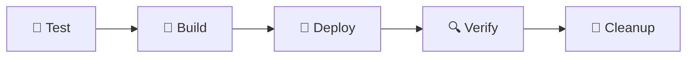

# 📋 Documentación del Pipeline CI/CD

## 🎯 Descripción General

Este pipeline automatiza el proceso de testing, construcción, despliegue y verificación de la aplicación **ABT Frontend** en el servidor de producción utilizando GitLab CI/CD.

---

## 🔄 Flujo del Pipeline



El pipeline sigue un enfoque **fail-fast**, ejecutando los tests primero para detectar problemas antes de construir la imagen Docker.

---

## 📊 Etapas del Pipeline

### 1️⃣ **Test** 🧪

**Propósito**: Ejecutar tests unitarios y generar reportes de cobertura antes de construir la imagen.

**Características**:
- 📦 Instala dependencias con `npm ci`
- 🧪 Ejecuta tests con Karma en modo headless (ChromeHeadless)
- 📊 Genera reportes de cobertura (JUnit y Cobertura)
- 💾 Guarda artifacts de cobertura por 30 días
- ⚡ **Fail-fast**: Si los tests fallan, no se ejecutan las siguientes etapas

**Scripts ejecutados**:
```bash
npm ci
npm run test -- --watch=false --browsers=ChromeHeadless
```

**Artifacts generados**:
- Reportes JUnit: `coverage/*/junit.xml`
- Reporte Cobertura: `coverage/*/cobertura-coverage.xml`
- Carpeta de cobertura completa

**Reglas de ejecución**:
- ✅ Automático en push a `main`
- 🔧 Manual desde GitLab UI

---

### 2️⃣ **Build** 🔧

**Propósito**: Construir la imagen Docker de la aplicación.

**Dependencias**: Requiere que `test` se complete exitosamente.

**Características**:
- 🐳 Construye imagen usando `docker-compose.prod.yml`
- 🏗️ Usa argumento de build `BUILD_ENV=production-abt`
- 🧹 Limpia imágenes Docker no utilizadas

**Scripts ejecutados**:
```bash
docker compose -f docker-compose.prod.yml build --build-arg BUILD_ENV=production-abt
docker image prune -f
```

**Reglas de ejecución**:
- ✅ Automático en push a `main` (si tests pasan)
- 🔧 Manual desde GitLab UI

---

### 3️⃣ **Deploy** 🚀

**Propósito**: Desplegar la aplicación en el servidor de producción.

**Dependencias**: Requiere que `build` se complete exitosamente.

**Características**:
- 🛑 Detiene contenedores anteriores
- 🚀 Inicia nuevos contenedores en modo detached
- ⏳ Espera 30 segundos para estabilización
- 🔍 Verifica el estado de los contenedores
- ✅ Realiza health check con `curl`

**Scripts ejecutados**:
```bash
docker compose -f docker-compose.prod.yml down
docker compose -f docker-compose.prod.yml up -d
sleep 30
docker compose -f docker-compose.prod.yml ps
curl -f http://localhost:4200
```

**Health Check**:
- URL verificada: `http://localhost:4200`
- Si el health check falla, el pipeline se detiene con error

**Reglas de ejecución**:
- ✅ Automático en push a `main` (si build es exitoso)
- 🔧 Manual desde GitLab UI

---

### 4️⃣ **Verify** 🔍

**Propósito**: Verificación post-despliegue para asegurar el correcto funcionamiento.

**Dependencias**: Requiere que `deploy` se complete exitosamente.

**Características**:
- 🌐 Prueba accesibilidad del frontend
- 📊 Muestra tiempo de respuesta HTTP
- 🔧 Valida configuración de Nginx
- 📝 Muestra últimos 20 logs del contenedor
- ⚠️ `allow_failure: true` - No falla el pipeline completo

**Scripts ejecutados**:
```bash
curl -s -o /dev/null -w "HTTP Status:%{http_code} Response Time:%{time_total}s" http://localhost:4200
docker compose -f docker-compose.prod.yml exec -T frontend nginx -t
docker compose -f docker-compose.prod.yml logs --tail=20 frontend
```

**Reglas de ejecución**:
- ✅ Automático en push a `main` (si deploy es exitoso)
- ⚠️ Permite fallos sin detener el pipeline

---

### 5️⃣ **Cleanup** 🧹

**Propósito**: Limpieza de recursos Docker no utilizados.

**Dependencias**: Requiere que `verify` se complete exitosamente.

**Características**:
- 🗑️ Elimina imágenes huérfanas (dangling)
- 📦 Elimina contenedores no utilizados
- 🔗 Elimina redes no utilizadas
- 📊 Muestra estado del sistema Docker
- ⏱️ Timeout de 3 minutos
- ⚠️ `allow_failure: true` - No falla el pipeline completo

**Scripts ejecutados**:
```bash
docker image prune -f
docker container prune -f
docker network prune -f
docker system df
```

**Reglas de ejecución**:
- ✅ Automático en push a `main` (si verify es exitoso)
- ⚠️ Permite fallos sin detener el pipeline

---

## 🔧 Variables de Configuración

| Variable | Valor | Descripción |
|----------|-------|-------------|
| `DOCKER_COMPOSE_FILE` | `docker-compose.prod.yml` | Archivo Docker Compose para producción |
| `PROJECT_NAME` | `abt-frontend` | Nombre del proyecto |
| `SERVICE_URL` | `http://localhost:4200` | URL del servicio para health checks |

---

## 🏷️ Tags de Runner

Todos los jobs requieren los siguientes tags de GitLab Runner:
- `frontend`
- `prod`

Esto asegura que los jobs se ejecuten en el runner correcto configurado para el frontend de producción.

---

## 📝 Reglas de Ejecución

### Ejecución Automática
Todas las etapas (excepto cleanup y verify que permiten fallos) se ejecutan automáticamente cuando:
```yaml
if: '$CI_COMMIT_BRANCH == "main"'
when: on_success
```

### Ejecución Manual
Todos los jobs pueden ser ejecutados manualmente desde la UI de GitLab:
```yaml
when: manual
```

---

## 📊 Reportes y Artifacts

### Test Coverage
- **Formato**: JUnit XML y Cobertura XML
- **Ubicación**: `coverage/` directory
- **Retención**: 30 días
- **Visualización**: Disponible en GitLab UI

### Expresión de Cobertura
```regex
/Lines\s*:\s*(\d+\.\d+)%/
```
Extrae el porcentaje de cobertura de líneas del output de tests.

---

## 🚨 Manejo de Errores

### Errores Críticos (Detienen el Pipeline)
- ❌ **Test**: Fallos en tests unitarios
- ❌ **Build**: Error al construir imagen Docker
- ❌ **Deploy**: Health check fallido después del despliegue

### Errores No Críticos (No Detienen el Pipeline)
- ⚠️ **Verify**: Fallos en verificaciones post-deploy
- ⚠️ **Cleanup**: Errores en limpieza de recursos

---

## 🔍 Monitoreo y Debug

### Ver Logs en Tiempo Real
```bash
# Ver logs del pipeline en GitLab
# CI/CD > Pipelines > [Pipeline específico]

# Ver logs del contenedor
docker compose -f docker-compose.prod.yml logs -f frontend
```

### Verificar Estado del Sistema
```bash
# Estado de contenedores
docker compose -f docker-compose.prod.yml ps

# Uso de recursos Docker
docker system df

# Imágenes disponibles
docker images | grep abt-frontend
```

---

## 🎯 Mejores Prácticas

### ✅ DO's
1. ✅ Ejecutar tests localmente antes de hacer push
2. ✅ Revisar los logs del pipeline en caso de fallos
3. ✅ Monitorear la cobertura de tests
4. ✅ Validar el health check después del deploy

### ❌ DON'Ts
1. ❌ No hacer push directo a `main` sin revisar tests
2. ❌ No ignorar warnings en la etapa de verify
3. ❌ No acumular imágenes Docker sin limpiar
4. ❌ No saltar la etapa de tests

---

## 🔄 Flujo de Trabajo Recomendado

```bash
# 1. Desarrollar feature en rama
git checkout -b feature/nueva-funcionalidad

# 2. Ejecutar tests localmente
npm test

# 3. Hacer commit y push
git add .
git commit -m "feat: nueva funcionalidad"
git push origin feature/nueva-funcionalidad

# 4. Crear Merge Request a main

# 5. El pipeline se ejecuta automáticamente
#    - Test → Build → Deploy → Verify → Cleanup

# 6. Revisar resultados en GitLab UI

# 7. Si todo es exitoso, merge a main
```

---

## 📞 Soporte y Troubleshooting

### Problemas Comunes

#### ❌ Tests fallan
```bash
# Ejecutar tests localmente para debug
npm test

# Ver detalles de cobertura
npm run test:coverage
```

#### ❌ Build falla
```bash
# Verificar sintaxis de docker-compose
docker compose -f docker-compose.prod.yml config

# Construir localmente
docker compose -f docker-compose.prod.yml build
```

#### ❌ Deploy falla en health check
```bash
# Verificar logs del contenedor
docker compose -f docker-compose.prod.yml logs frontend

# Probar acceso manual
curl -v http://localhost:4200
```

---

## 📚 Referencias

- [GitLab CI/CD Documentation](https://docs.gitlab.com/ee/ci/)
- [Docker Compose Documentation](https://docs.docker.com/compose/)
- [Angular Testing Guide](https://angular.io/guide/testing)

---

## 🔐 Seguridad

- 🔒 El pipeline solo se ejecuta en runners con tags autorizados
- 🔑 Variables sensibles deben configurarse en GitLab CI/CD settings
- 🛡️ Los artifacts expiran automáticamente después de 30 días

---

**Última actualización**: Noviembre 7, 2025
**Versión del Pipeline**: 2.0
**Mantenido por**: Equipo de Desarrollo ABT Frontend
